# 🚀 Enhanced Multi-Agent PostgreSQL Analysis System

A production-ready, enterprise-grade multi-agent system that orchestrates intelligent queries across multiple PostgreSQL databases with **standardized MCP Protocol** integration using the official [executeautomation/mcp-database-server](https://github.com/executeautomation/mcp-database-server) npm package.

## 🏗️ Advanced Architecture

### Core System Components
- **🔌 MCP Database Server**: Official npm package from executeautomation for standardized database operations
- **🧠 Enhanced Orchestrator**: Advanced LangGraph workflows with intelligent query planning
- **🤖 Specialized Agents**: User Analysis, Transaction Analysis, and Advanced Analytics agents
- **🗄️ Advanced Database Manager**: Connection pooling, schema analysis, and performance optimization
- **🔄 Multi-Provider LLM Client**: OpenRouter, OpenAI, Anthropic with automatic failover
- **📊 Prometheus Monitoring**: Real-time metrics, performance tracking, and health monitoring

### Production Features
- **🐳 Docker Deployment**: Complete containerization with docker-compose orchestration
- **🔄 CI/CD Pipeline**: GitHub Actions with automated testing, security scanning, and deployment
- **🔒 Enterprise Security**: SSL connections, rate limiting, API authentication, vulnerability scanning
- **📈 Monitoring Stack**: Prometheus + Grafana integration with custom dashboards
- **🧪 Comprehensive Testing**: Unit tests, integration tests, performance tests, security audits

## Quick Start

### 1. Setup Environment

```bash
# Create virtual environment
python -m venv multiagent_env
multiagent_env\Scripts\activate  # Windows
# source multiagent_env/bin/activate  # Linux/Mac

# Install Python dependencies
pip install -r requirements.txt

# Install npm dependencies (includes MCP database server)
npm install
```

### 2. Configuration

Copy `.env.template` to `.env` and update with your credentials:
```env
# OpenRouter API Key
OPENROUTER_API_KEY=your_api_key_here

# Database 1 (Users)
DB1_HOST=your-aiven-host-1.aivencloud.com
DB1_NAME=users_database
DB1_USER=your_username
DB1_PASSWORD=your_password
DB1_PORT=5432

# Database 2 (Transactions) 
DB2_HOST=your-aiven-host-2.aivencloud.com
DB2_NAME=transactions_database
DB2_USER=your_username
DB2_PASSWORD=your_password
DB2_PORT=5432
```

### 3. Test Setup

```bash
python tests/test_setup.py
```

### 4. Run System

**🚀 Run Both Web Interface + MCP Server (Recommended):**
```bash
# Windows - Using npm package MCP server  
start_npm_mcp.bat

# Linux/Mac - Using npm package MCP server
./start_npm_mcp.sh

# Alternative: Using npm scripts
npm run start-both

# Services will be available at:
# - Web Interface: http://localhost:8501
# - MCP Database Server: Available for Claude integration
```

**🐳 Docker Deployment (Full Stack):**
```bash
# Launch complete stack with monitoring
docker-compose up -d

# View logs
docker-compose logs -f

# Access services:
# - Web Interface: http://localhost
# - Grafana Monitoring: http://localhost/monitoring/
# - Prometheus Metrics: http://localhost:9091
```

**Individual Services:**

**🌐 Web Interface Only:**
```bash
# Launch Streamlit web interface
streamlit run streamlit_app.py
# Or use the launcher script
run_streamlit.bat  # Windows
./run_streamlit.sh # Linux/Mac
```

**🔌 MCP Database Server Only:**
```bash
# Using npm package directly
npx @executeautomation/database-server --postgresql --host localhost --database your_db --user your_user --password your_pass --port 5432

# Using npm scripts with environment variables
npm run mcp-postgres-env

# Available Tools: read_query, write_query, create_table, list_tables, describe_table, export_query, append_insight, list_insights
```

**💻 Command Line Interface:**
```bash
# Interactive mode
python src/main.py

# Single query
python src/main.py "Find high-value customers and their transaction patterns"
```

## MCP Database Server Tools

The system uses the official **@executeautomation/database-server** npm package which provides standardized MCP database operations:

### 🗄️ Available Database Tools
- **read_query**: Execute SELECT queries with detailed results
- **write_query**: Execute INSERT, UPDATE, or DELETE queries
- **create_table**: Create new database tables
- **alter_table**: Modify existing table schemas
- **drop_table**: Remove tables with safety confirmation
- **list_tables**: Get a list of all tables in the database
- **describe_table**: View detailed schema information for specific tables
- **export_query**: Export query results to CSV or JSON formats
- **append_insight**: Add business insights to the knowledge memo
- **list_insights**: List all stored business insights

### 🎯 Benefits of Official npm Package
- **✅ Maintained**: Actively maintained by executeautomation team
- **✅ Standardized**: Follows official MCP protocol specifications  
- **✅ Reliable**: Production-tested database operations
- **✅ Compatible**: Works with any MCP-compatible AI system
- **✅ Secure**: Built-in security features and validation

## 🎯 Flow Diagrams

### 🏗️ System Architecture Flow

```mermaid
graph TB
    subgraph "User Interfaces"
        UI1[🌐 Streamlit Web Interface<br/>Port 8501]
        UI2[🤖 Claude AI<br/>MCP Client]
    end
    
    subgraph "Application Layer"
        STREAM[📊 Streamlit App<br/>streamlit_app.py]
        ORCH[🧠 Enhanced Orchestrator<br/>orchestrator.py]
        AGENTS[🤖 Specialized Agents<br/>User/Transaction/Analytics]
    end
    
    subgraph "MCP Integration"
        MCP[🔌 NPM MCP Server<br/>@executeautomation/database-server<br/>Port: MCP Protocol]
        TOOLS[🛠️ Database Tools<br/>read_query, write_query<br/>list_tables, export_query]
    end
    
    subgraph "Data Layer"
        DEMO[(📁 Demo SQLite DB<br/>./data/demo.db)]
        PROD[(🗄️ PostgreSQL DBs<br/>Users & Transactions)]
        POOL[⚡ Connection Pool<br/>AsyncPG + SQLAlchemy]
    end
    
    subgraph "Monitoring & Config"
        PROM[📈 Prometheus Metrics]
        CONFIG[⚙️ Config Management<br/>.env + config.py]
        LOG[📝 Logging System]
    end
    
    %% User Interface Connections
    UI1 --> STREAM
    UI2 --> MCP
    
    %% Application Flow
    STREAM --> ORCH
    STREAM --> CONFIG
    ORCH --> AGENTS
    AGENTS --> POOL
    
    %% MCP Flow
    MCP --> TOOLS
    TOOLS --> DEMO
    TOOLS --> PROD
    
    %% Data Connections
    POOL --> PROD
    ORCH --> PROM
    AGENTS --> LOG
    
    %% Styling
    classDef userInterface fill:#e1f5fe
    classDef application fill:#f3e5f5
    classDef mcp fill:#e8f5e8
    classDef data fill:#fff3e0
    classDef monitoring fill:#fce4ec
    
    class UI1,UI2 userInterface
    class STREAM,ORCH,AGENTS application
    class MCP,TOOLS mcp
    class DEMO,PROD,POOL data
    class PROM,CONFIG,LOG monitoring
```


### 🔄 Data Processing Flow

```mermaid
sequenceDiagram
    participant User as 👤 User
    participant Web as 🌐 Streamlit Web
    participant Claude as 🤖 Claude AI
    participant MCP as 🔌 MCP Server
    participant Orch as 🧠 Orchestrator
    participant Agent as 🤖 Specialized Agent
    participant DB as 🗄️ Database
    participant Monitor as 📊 Monitoring
    
    Note over User,Monitor: Multi-Path Data Processing
    
    %% Web Interface Path
    User->>Web: 1. Submit Query
    Web->>Orch: 2. Process Query
    Orch->>Agent: 3. Delegate to Specialist
    Agent->>DB: 4. Execute SQL
    DB-->>Agent: 5. Return Data
    Agent->>Agent: 6. Analyze & Enrich
    Agent-->>Orch: 7. Processed Results
    Orch->>Monitor: 8. Log Metrics
    Orch-->>Web: 9. Combined Insights
    Web-->>User: 10. Display Results
    
    Note over User,Monitor: ---
    
    %% MCP/Claude Path  
    Claude->>MCP: 1. MCP Tool Call
    Note over MCP: read_query, list_tables, etc.
    MCP->>DB: 2. Direct SQL Execution
    DB-->>MCP: 3. Raw Results
    MCP->>MCP: 4. Format for Claude
    MCP-->>Claude: 5. Structured Response
    Claude->>Claude: 6. AI Analysis
    
    Note over User,Monitor: ---
    
    %% Cross-System Integration
    Claude->>MCP: append_insight("Analysis Result")
    Web->>Orch: Get stored insights
    Orch->>DB: Query insights table
    DB-->>Web: Display to user
```


### 🤖 Multi-Agent Workflow

```mermaid
flowchart TD
    START([🚀 User Query Received]) --> PARSE{📝 Parse Query Intent}
    
    PARSE -->|User Analysis| UA[👥 User Analysis Agent]
    PARSE -->|Transaction Analysis| TA[💰 Transaction Agent]
    PARSE -->|General Analytics| AA[📊 Analytics Agent]
    PARSE -->|Cross-Database| MULTI[🔄 Multi-Agent Coordination]
    
    subgraph "User Analysis Agent Flow"
        UA --> UA1[🔍 Identify User Patterns]
        UA1 --> UA2[📊 Demographic Analysis]
        UA2 --> UA3[⏱️ Activity Tracking]
        UA3 --> UA4[📈 User Segmentation]
    end
    
    subgraph "Transaction Analysis Agent Flow"
        TA --> TA1[💳 Transaction Patterns]
        TA1 --> TA2[🏷️ Category Analysis]
        TA2 --> TA3[💰 Spending Behavior]
        TA3 --> TA4[🎯 Fraud Detection]
    end
    
    subgraph "Analytics Agent Flow"
        AA --> AA1[📈 Trend Analysis]
        AA1 --> AA2[🔗 Correlation Finding]
        AA2 --> AA3[🎯 Insight Generation]
        AA3 --> AA4[📊 Visualization Prep]
    end
    
    %% Results Consolidation
    UA4 --> CONSOLIDATE[🔄 Data Consolidation]
    TA4 --> CONSOLIDATE
    AA4 --> CONSOLIDATE
    
    CONSOLIDATE --> CORRELATE[🔗 Cross-Reference Data]
    CORRELATE --> INSIGHTS[💡 Generate AI Insights]
    INSIGHTS --> RECOMMEND[🎯 Create Recommendations]
    
    %% Output Generation
    RECOMMEND --> FORMAT{📄 Format Output}
    FORMAT -->|Web UI| WEB[🌐 Streamlit Display]
    FORMAT -->|MCP Response| MCP_OUT[🔌 Claude Integration]
    FORMAT -->|API Response| API[📡 JSON Response]
    
    %% Final Outputs
    WEB --> END1([✅ Web Dashboard])
    MCP_OUT --> END2([✅ Claude Response])
    API --> END3([✅ API Result])
```


## Example Queries

- "Show me all active users"
- "Find high-value customers and their recent transactions"
- "Analyze user behavior patterns across databases"
- "Compare transaction volumes by user segment"

## System Components

### Parent Agent (`src/agents/parent_agent.py`)
- Query analysis and execution planning
- Sub-agent coordination
- Data consolidation
- Insight generation

### Database Agents (`src/utils/mcp_client.py`)
- Direct PostgreSQL connections
- Query execution
- Schema introspection
- Data retrieval

### LangGraph Workflow
- State management across agents
- Dependency resolution
- Error handling
- Parallel execution where possible

## Features

- **🌐 Modern Web Interface**: Beautiful Streamlit-based dashboard
- **🤖 Multi-database orchestration**: Query across multiple PostgreSQL databases
- **🔗 Cross-database dependencies**: Agents share data intelligently  
- **🧠 LLM-powered insights**: AI analysis using OpenRouter/GPT-4
- **📊 Real-time analytics**: Query history, performance metrics, and visualizations
- **⚙️ Easy configuration**: Web-based database setup and testing
- **🔄 Robust error handling**: Graceful failures and detailed diagnostics
- **📱 Responsive design**: Works on desktop, tablet, and mobile
- **🎯 Interactive modes**: Web UI, CLI, and programmatic API

## Development

```bash
# Run tests
python tests/test_setup.py

# Debug mode
set DEBUG=True && python src/main.py
```

## SQL Schema Assumptions

The system assumes basic table structures:

**Users Database:**
- `users` table with columns: `user_id`, `username`, `email`, `created_at`, `last_login`, `status`

**Transactions Database:**  
- `transactions` table with columns: `user_id`, `transaction_date`, `amount`, `category`, `merchant`

Adjust the SQL queries in `src/utils/mcp_client.py` to match your actual schema.

## Security

- SSL connections to databases
- Environment variable configuration
- No hardcoded credentials