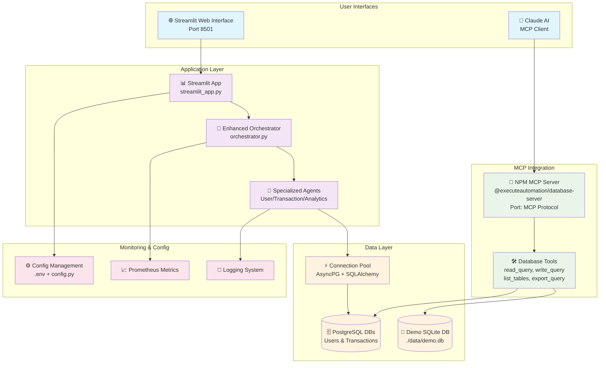

# System Architecture Flow

```mermaid
graph TB
    subgraph "User Interfaces"
        UI1[🌐 Streamlit Web Interface<br/>Port 8501]
        UI2[🤖 Claude AI<br/>MCP Client]
    end
    
    subgraph "Application Layer"
        STREAM[📊 Streamlit App<br/>streamlit_app.py]
        ORCH[🧠 Enhanced Orchestrator<br/>orchestrator.py]
        AGENTS[🤖 Specialized Agents<br/>User/Transaction/Analytics]
    end
    
    subgraph "MCP Integration"
        MCP[🔌 NPM MCP Server<br/>@executeautomation/database-server<br/>Port: MCP Protocol]
        TOOLS[🛠️ Database Tools<br/>read_query, write_query<br/>list_tables, export_query]
    end
    
    subgraph "Data Layer"
        DEMO[(📁 Demo SQLite DB<br/>./data/demo.db)]
        PROD[(🗄️ PostgreSQL DBs<br/>Users & Transactions)]
        POOL[⚡ Connection Pool<br/>AsyncPG + SQLAlchemy]
    end
    
    subgraph "Monitoring & Config"
        PROM[📈 Prometheus Metrics]
        CONFIG[⚙️ Config Management<br/>.env + config.py]
        LOG[📝 Logging System]
    end
    
    %% User Interface Connections
    UI1 --> STREAM
    UI2 --> MCP
    
    %% Application Flow
    STREAM --> ORCH
    STREAM --> CONFIG
    ORCH --> AGENTS
    AGENTS --> POOL
    
    %% MCP Flow
    MCP --> TOOLS
    TOOLS --> DEMO
    TOOLS --> PROD
    
    %% Data Connections
    POOL --> PROD
    ORCH --> PROM
    AGENTS --> LOG
    
    %% Styling
    classDef userInterface fill:#e1f5fe
    classDef application fill:#f3e5f5
    classDef mcp fill:#e8f5e8
    classDef data fill:#fff3e0
    classDef monitoring fill:#fce4ec
    
    class UI1,UI2 userInterface
    class STREAM,ORCH,AGENTS application
    class MCP,TOOLS mcp
    class DEMO,PROD,POOL data
    class PROM,CONFIG,LOG monitoring
```